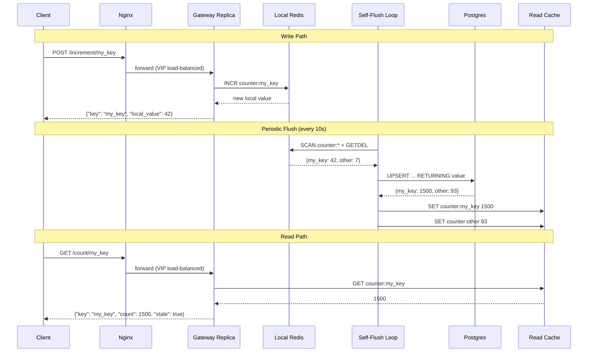

# Atomic Counter

A distributed, horizontally-scalable counter service built with Rust and deployed on Docker Swarm. Writes are absorbed locally at each gateway replica for maximum throughput, then periodically flushed to Postgres and a shared read cache.

## Architecture

```mermaid
graph TB
    subgraph Internet
        Client["Client"]
    end

    subgraph Docker Swarm – overlay network
        Nginx["Nginx<br/>:80"]

        subgraph Gateway Replica 1
            Axum1["Axum HTTP<br/>:3000"]
            Redis1[("Local Redis<br/>:6379")]
            Flush1["Self-Flush Loop<br/>every 10s"]
            Axum1 -- "INCR counter:key" --> Redis1
            Flush1 -- "SCAN + GETDEL" --> Redis1
        end

        subgraph Gateway Replica 2
            Axum2["Axum HTTP<br/>:3000"]
            Redis2[("Local Redis<br/>:6379")]
            Flush2["Self-Flush Loop<br/>every 10s"]
            Axum2 -- "INCR counter:key" --> Redis2
            Flush2 -- "SCAN + GETDEL" --> Redis2
        end

        subgraph Gateway Replica N
            AxumN["Axum HTTP<br/>:3000"]
            RedisN[("Local Redis<br/>:6379")]
            FlushN["Self-Flush Loop<br/>every 10s"]
            AxumN -- "INCR counter:key" --> RedisN
            FlushN -- "SCAN + GETDEL" --> RedisN
        end

        ReadCache[("Redis Read Cache<br/>(shared)")]
        Postgres[("Postgres<br/>counters table")]
        Aggregator["Aggregator<br/>(migration runner)"]
    end

    Client -- "POST /increment/:key<br/>GET /count/:key" --> Nginx
    Nginx -- "VIP gateway:3000" --> Axum1
    Nginx -- "VIP gateway:3000" --> Axum2
    Nginx -- "VIP gateway:3000" --> AxumN

    Axum1 -- "GET counter:key" --> ReadCache
    Axum2 -- "GET counter:key" --> ReadCache
    AxumN -- "GET counter:key" --> ReadCache

    Flush1 -- "UPSERT deltas" --> Postgres
    Flush2 -- "UPSERT deltas" --> Postgres
    FlushN -- "UPSERT deltas" --> Postgres

    Flush1 -- "SET totals" --> ReadCache
    Flush2 -- "SET totals" --> ReadCache
    FlushN -- "SET totals" --> ReadCache

    Aggregator -- "CREATE TABLE IF NOT EXISTS" --> Postgres
```

## Data Flow



## Key Design Decisions

| Decision | Rationale |
|----------|-----------|
| **Local Redis per gateway** | Writes are sub-millisecond; no cross-network hop on the hot path |
| **Gateway self-flush** | Each replica drains its own Redis → Postgres → read cache, using only VIP connections that work reliably in Docker Swarm |
| **Shared read cache** | All replicas serve reads from the same Redis, providing a consistent (eventually) view |
| **Stale reads** | Reads are fast but may lag behind by up to one flush interval (~10s) |
| **Aggregator as migration runner** | Ensures the Postgres schema exists; gateways also run the migration idempotently for resilience |

## Quick Start

```bash
# Build images
docker compose build

# Deploy to Swarm
./deploy.sh

# Scale gateway replicas
./scale.sh 5

# Run integration test
./test.sh
```

## Services

| Service | Image | Replicas | Purpose |
|---------|-------|----------|---------|
| **nginx** | `nginx:alpine` | 1 | Reverse proxy, exposes port 80 |
| **gateway** | `atomic_counter-gateway` | 3 (scalable) | HTTP API + local Redis + self-flush loop |
| **aggregator** | `atomic_counter-aggregator` | 1 | Schema migration runner |
| **postgres** | `postgres:16-alpine` | 1 | Persistent counter storage |
| **redis-readcache** | `redis:7-alpine` | 1 | Shared read cache for fast lookups |

## API

| Endpoint | Method | Description |
|----------|--------|-------------|
| `/increment/:key` | POST | Increment counter, returns local value |
| `/count/:key` | GET | Read current total (eventually consistent) |
| `/health` | GET | Health check with replica hostname |
